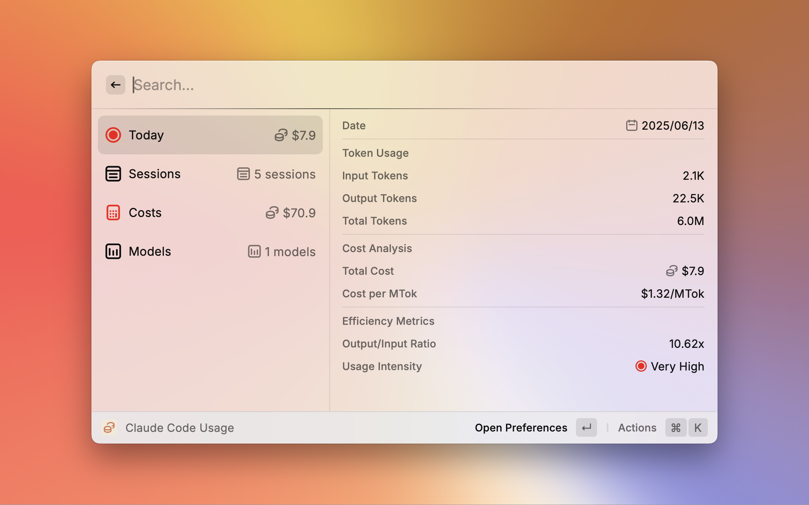

# Claude Code Usage (ccusage)

[English](README.md) | **日本語**

> [!IMPORTANT]
> **このリポジトリはアーカイブされており、現在はメンテナンスされていません。**
> 
> 拡張機能は以下の場所に移動されました: https://github.com/nyatinte/extensions/tree/ext/ccusage/extensions/ccusage
> 
> 最新のアップデート、問題報告、サポートについては新しい場所をご確認ください。

  
  
  [ccusage](https://github.com/ryoppippi/ccusage) CLIツールを使用してClaude Codeの使用統計をリアルタイムで監視するRaycast拡張機能です。
  
  
  

## 機能

包括的なリアルタイム統計でClaude Codeの使用量を監視できます：

- **日次使用量**: 本日の入力/出力トークンとコストを視覚的な強度インジケーターで追跡
- **セッション履歴**: モデル別の詳細とアイコンで最近の使用セッションを表示
- **コスト分析**: 月次予測と支出インサイトを含む詳細なコスト追跡
- **モデル統計**: Claude モデル（Opus、Sonnet、Haiku）別の使用量分析と階層グループ化
- **メニューバー統合**: システムメニューバーから使用量統計に素早くアクセス
- **ランタイムの柔軟性**: 複数のJavaScriptランタイム（npx、bunx、pnpm、deno）をサポート
- **タイムゾーンサポート**: 正確な日付表示のためのカスタマイズ可能なタイムゾーン設定

## スクリーンショット

### メイン使用量ビュー

## 必要要件

この拡張機能が正常に動作するには、[ccusage](https://github.com/ryoppippi/ccusage) CLIツールが必要です。拡張機能は、お好みのJavaScriptランタイムを使用してccusageのインストールと実行を自動的に試行します。

### サポートされているランタイム

- **npx** (Node Package Execute) - デフォルト
- **bunx** (Bun Package Execute)
- **pnpm dlx** (PNPM Package Execute)
- **deno run** (Deno Runtime)

## セットアップ

1. Raycast StoreからExtensionをインストール
2. 拡張機能を開く - 初期セットアップをガイドします
3. 必要に応じて設定でお好みのJavaScriptランタイムを設定
4. 拡張機能が自動的にClaude Codeの使用データを取得します

## 重要な注意事項

- **非公式拡張機能**: この拡張機能はAnthropic社やccusage開発者の公式製品ではありません
- **データプライバシー**: すべての使用データはccusage CLIツールを使用してローカルで処理されます
- **パフォーマンス**: 拡張機能はリアルタイム更新とシステムパフォーマンスのバランスを取るために最適化された更新間隔を使用します

## サポート

問題が発生した場合や提案がある場合は、新しいリポジトリで[イシューを作成](https://github.com/nyatinte/extensions/issues)してください。

## クレジット

この拡張機能のRaycastレイアウトは、[System Monitor](https://www.raycast.com/hossammourad/raycast-system-monitor) 拡張機能からインスピレーションを得ています。

この拡張機能を可能にした[ccusage](https://github.com/ryoppippi/ccusage)ツールを作成してくださった[@ryoppippi](https://github.com/ryoppippi)さんに特別な感謝を申し上げます。

## ライセンス

MIT