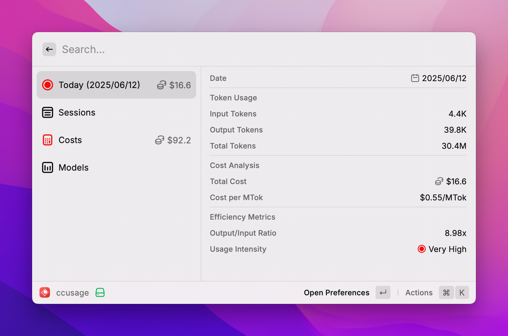
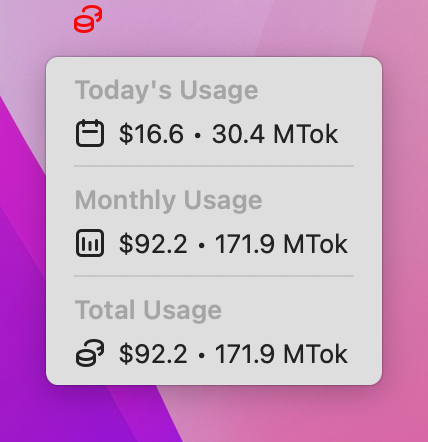
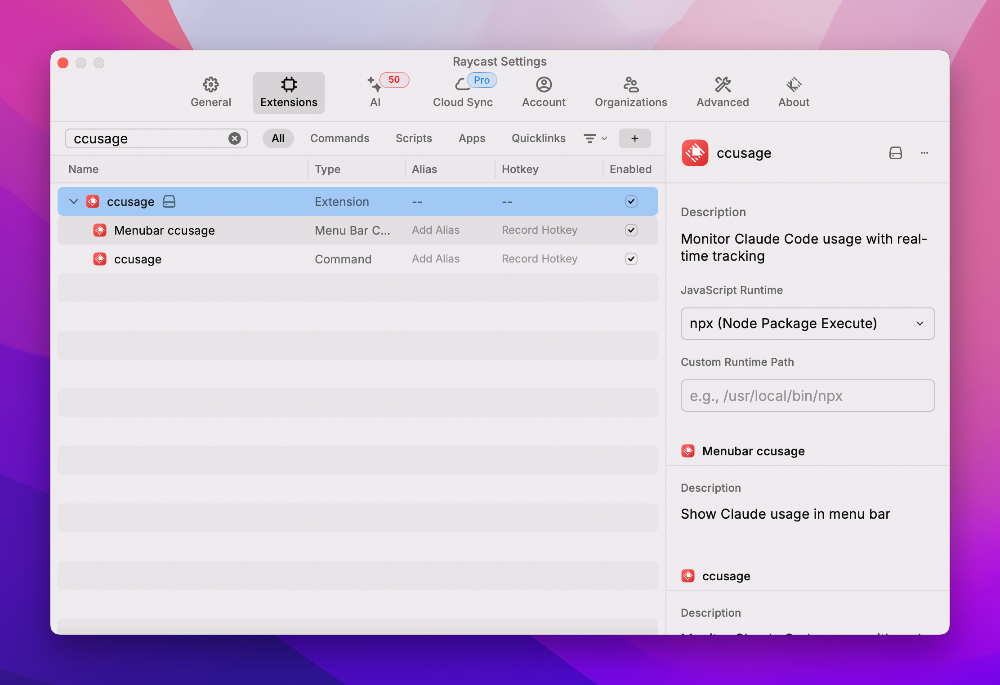

# ccusage

A Raycast extension that monitors Claude Code usage using [ccusage](https://github.com/ryoppippi/ccusage).

## Features

Monitor your Claude Code usage with real-time statistics including:

- **Daily Usage**: Track input/output tokens and costs for today
- **Session History**: View recent usage sessions with model breakdown  
- **Cost Analysis**: Detailed cost breakdown and projections
- **Model Statistics**: Usage analytics by Claude model (Opus, Sonnet, Haiku)
- **Menu Bar**: Quick access to usage stats from the menu bar

## Screenshots

### Main Usage View

### Menu Bar Integration

### Preferences

## ⚠️ Important Notes

- **Under Development**: This extension is currently under development and many features may not work properly
- **Unofficial**: This extension is not an official product of Anthropic or the ccusage developers
- **Experimental**: Unstable behavior and errors may occur

## Issue Reporting

If you encounter any problems or bugs, please create an issue in this repository.

## Credits

The Raycast layout of this extension was inspired by the [System Monitor](https://www.raycast.com/hossammourad/raycast-system-monitor) extension.

Special thanks to [@ryoppippi](https://github.com/ryoppippi) for creating the [ccusage](https://github.com/ryoppippi/ccusage) tool that makes this extension possible.

## License

MIT